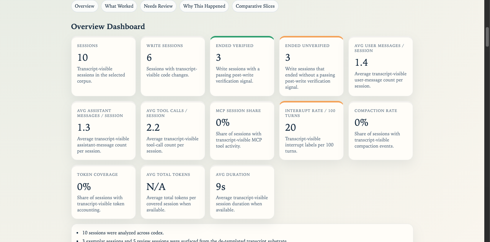

# agent-eval

`agent-eval` helps engineers and reviewers turn local coding-agent transcripts into deterministic, public-safe HTML reports without uploading raw session logs or relying on anecdotal scoring.



## What you are seeing

This screenshot shows the generated static HTML dashboard: navigation pills, metric cards, and verification status styling rendered from the same deterministic artifacts that the CLI writes to disk. The same report continues with SVG charts, exemplar sessions, review queue, attribution, and methodology sections. The preview image was generated from checked-in synthetic Codex fixtures, not from private local transcripts.

The HTML report helps readers see:

- how many sessions and write sessions were analyzed
- how often write sessions ended verified or unverified
- provider, harness, tool-family, and attribution mixes
- exemplar sessions worth learning from
- review-queue sessions worth inspecting

It does **not** claim anything about your private transcripts until you run `inspect` or `eval` against your own local agent home.

## Who this is for

- Engineering leads adopting coding agents who need repeatable usage evidence.
- Developers who want to review their own Codex, Claude Code, pi, or opencode sessions.
- Evaluators and portfolio reviewers who want proof beyond screenshots or informal impressions.
- Maintainers who need static artifacts that can be inspected without a hosted service.

## Problem

Developer-agent work leaves useful evidence in local transcripts, but that evidence is hard to compare:

- each provider stores sessions differently
- raw logs are noisy and often sensitive
- anecdotes do not show verification, friction, or review-worthy patterns
- dashboards are not trustworthy if they are detached from auditable artifacts

`agent-eval` keeps transcript/session artifacts as the canonical input, normalizes supported providers into one model, and emits deterministic JSON/JSONL plus static Markdown/HTML/SVG reports.

## What it does

| Problem | Capability | Proof |
|---|---|---|
| Agent homes are provider-specific | Discovers Codex, Claude Code, pi, and opencode transcript stores through source-aware adapters | `pnpm inspect --source opencode --home ~/.local/share/opencode` |
| Raw transcripts are too noisy to review directly | Normalizes sessions, turns, tools, labels, compliance, attribution, and session facts | `docs/schema-v3.md` |
| Teams need a quick read of usage patterns | Generates a static dashboard with overview, what worked, needs review, and why it happened | `docs/report-v3.md` |
| Public sharing can leak too much context | Uses redacted, truncated previews and local public-surface scan commands | `pnpm scan:repo` and `pnpm scan:artifacts <path>` |
| Rule changes need regression protection | Runs a synthetic calibration benchmark across expected labels, incidents, attribution, and surfaced sessions | `pnpm benchmark` |

## Fastest way to see the HTML

Requirements:

- Node.js 22.16+
- pnpm 10+

This repository is GitHub-first and is not currently published to npm.

```bash
git clone https://github.com/fitchmultz/agent-eval.git
cd agent-eval
pnpm install
rm -rf artifacts/demo-home artifacts/demo-report
mkdir -p artifacts/demo-home/sessions
cp src/calibration/fixtures/codex-*.jsonl artifacts/demo-home/sessions/
pnpm eval --source codex --home artifacts/demo-home --output-dir artifacts/demo-report --summary-only
```

Expected result: a generated static report at `artifacts/demo-report/report.html`, plus the canonical JSON/JSONL/SVG artifact bundle in the same directory. Open that HTML file in your browser to inspect the dashboard, charts, review queue, and methodology sections.

For a faster calibration-only check that does not generate the HTML report, run `pnpm benchmark`.

## Run it on your local transcripts

Start with discovery. It inventories canonical transcripts plus optional enrichment stores when present.

```bash
pnpm inspect --source codex --home ~/.codex
pnpm inspect --source claude --home ~/.claude
pnpm inspect --source pi --home ~/.pi
pnpm inspect --source opencode --home ~/.local/share/opencode
```

Run the full deterministic pipeline and open the static report from `artifacts/report.html`.

```bash
pnpm eval --source pi --home ~/.pi --output-dir artifacts --summary-only
```

Use date filters and a time bucket when you want a bounded corpus:

```bash
pnpm eval --source pi --home ~/.pi \
  --output-dir artifacts \
  --summary-only \
  --start-date 2026-03-01 \
  --end-date 2026-03-31 \
  --time-bucket day
```

By default, CLI evaluation uses a bounded window of the 100 most recent discovered sessions to avoid loading very large local corpora into memory. When `--session-limit` is set, the limit applies to the most recent discovered sessions after date filtering.

## Supported sources

- `codex`: canonical transcripts under `~/.codex/sessions/**/*.jsonl`
- `claude`: canonical transcripts under `~/.claude/projects/**/*.jsonl`
- `pi`: canonical transcripts under `~/.pi/agent/sessions/**/*.jsonl`
- `opencode`: canonical session metadata under `~/.local/share/opencode/storage/session/**/*.json`, joined with related `storage/message` and `storage/part` records

Optional enrichment stores such as history, SQLite, shell snapshots, opencode databases/logs, and session environment files are inventoried when present, but transcript/session artifacts remain the canonical input.

## Command reference

```bash
pnpm inspect --source pi --home ~/.pi
pnpm inspect --source opencode --home ~/.local/share/opencode
pnpm parse --source codex --home ~/.codex --output-dir artifacts
pnpm eval --source claude --home ~/.claude --output-dir artifacts
pnpm report --source codex --home ~/.codex --output-dir artifacts
pnpm benchmark
```

Use `parse` when you only want normalized turn reconstruction; it writes `raw-turns.jsonl` and `parse-metrics.json` without scoring or report generation. Use `report` when you want the Markdown report on stdout while still writing the full evaluation artifact bundle.

Example local config:

```bash
cp .agent-evalrc.example .agent-evalrc
```

Built binary smoke path:

```bash
pnpm build
node dist/cli.js inspect --source pi --home ~/.pi
```

## Outputs

`eval` and `report` always emit the canonical v3 bundle:

- `metrics.json`
- `summary.json`
- `session-facts.jsonl`
- `release-manifest.json`

Every machine-readable output includes `engineVersion` and `schemaVersion`. `release-manifest.json` also records release provenance such as the current git revision when available, dirty-worktree state, config fingerprint, evaluation parameters, and emitted artifact inventory.

Presentation outputs:

- `report.md`
- `report.html`
- `favicon.ico`
- `favicon.svg`
- `sessions-over-time.svg`
- `provider-share.svg`
- `harness-share.svg`
- `tool-family-share.svg`
- `attribution-mix.svg`

Full mode also emits heavier drilldown files:

- `raw-turns.jsonl`
- `incidents.jsonl`

`--summary-only` is the preferred mode for large corpora. It skips the heavier raw-turn and incident JSONL files while preserving the dashboard, session facts, release manifest, and static reports.

## How to read the report

Read the v3 report top to bottom:

1. **Overview Dashboard** — corpus metrics and diagnostic context.
2. **What Worked** — exemplar sessions and learning surfaces.
3. **Needs Review** — ranked sessions worth deeper inspection.
4. **Why This Happened** — attribution and template-substrate context.
5. **Comparative Slices** — deterministic slice comparisons.
6. **Methodology And Limitations** — caveats and scope.
7. **Inventory** — discovered local inputs.

If a presentation artifact ever disagrees with the JSON artifacts, treat the JSON artifacts as canonical.

## How it works

```text
source home
  -> discovery inventory
  -> source-specific parser
  -> normalized sessions + turns
  -> labels + incidents + compliance
  -> metrics + summary artifact + session facts
  -> markdown/html/svg reports
```

Key implementation choices:

- **Transcript-first:** canonical analytics starts from transcript/session artifacts, not optional side stores.
- **Source-aware adapters:** Codex, Claude Code, pi, and opencode use separate discovery/parsing logic, then converge on one normalized session model.
- **Deterministic scoring:** labels, clustering, compliance scoring, summaries, and presentation artifacts are rule-based.
- **Redacted previews:** generated reports prefer redacted, truncated previews over full transcript bodies.
- **Static export:** HTML, Markdown, JSON, JSONL, and SVG outputs stay portable and dependency-light.

## Project map

| Path | Purpose |
|---|---|
| `src/cli/` | CLI command wiring and option handling |
| `src/discovery.ts` and `src/sources.ts` | Source discovery and supported-provider definitions |
| `src/transcript/` | Transcript event normalization helpers |
| `src/evaluator.ts` | Evaluation orchestration from discovery through artifact generation |
| `src/metrics-aggregation.ts` | Corpus metrics aggregation |
| `src/summary*.ts` and `src/summary/` | Canonical summary and presentation section derivation |
| `src/html-report/`, `src/report.ts`, `src/svg-charts.ts` | Static HTML, Markdown, and SVG presentation outputs |
| `src/calibration/` | Synthetic benchmark fixtures and calibration runner |
| `tests/` | Synthetic fixture-based regression tests |
| `docs/schema-v3.md` | Canonical artifact contract |
| `docs/report-v3.md` | Report product model |
| `docs/case-study.md` | Architecture and design rationale |

## Local verification

Baseline local gate:

```bash
make ci
```

Equivalent explicit command:

```bash
pnpm lint && pnpm typecheck && pnpm test && pnpm benchmark && pnpm scan:artifacts artifacts/benchmark && pnpm scan:repo && pnpm build && pnpm smoke:dist
```

Useful focused commands:

```bash
pnpm test
pnpm benchmark
pnpm scan:artifacts artifacts/benchmark
pnpm scan:repo
```

`make ci` is not formatting-mutating, but it does generate benchmark and dist smoke artifacts as part of validation. Use `make bootstrap` for first-time dependency setup and `make fix` when you want formatting rewrites.

## Public repo hygiene

- Tests use synthetic fixtures only; no private transcript corpora are committed.
- Local evaluation outputs, local agent homes, and temporary analysis material stay untracked.
- Generated report previews are redacted and truncated, but they are not a substitute for full secret scanning.
- Use `pnpm scan:artifacts <path...>` before sharing generated `.json`, `.jsonl`, `.md`, `.html`, or `.svg` artifacts.
- Use `pnpm scan:repo` before publishing repo changes.
- Visual QA screenshots should stay local under ignored `notes/**/verification/` paths unless intentionally curated.

## Current limits

Real today:

- local CLI for Codex, Claude Code, pi, and opencode transcript/session artifacts
- deterministic parsing, labeling, clustering, scoring, and attribution
- static HTML/Markdown/SVG report generation
- canonical v3 machine-readable artifacts
- synthetic fixture coverage and calibration benchmark

Not in scope yet:

- semantic proof that repository state at the end of a session is correct
- deep optional-store joins beyond transcript-first enrichment
- model-graded interpretation of transcript quality
- hosted dashboards or live multi-user service behavior
- npm package publication

## Documentation

- `docs/schema-v3.md` — canonical artifact contract
- `docs/report-v3.md` — report/product model
- `docs/case-study.md` — architecture and design context

## Release signoff

For a final public-release pass, regenerate the provider QA bundles locally under `artifacts/`, review them, then run:

```bash
make release-check
```

`make release-check` extends the baseline gate by requiring a clean `main` worktree that matches upstream, validating final QA manifests, scanning benchmark and final QA artifacts, and rerunning the clean/upstream check after validation.

## Next action

Generate the synthetic HTML preview first, then run `inspect` against the local agent home you actually use and open `artifacts/report.html` after `eval`.
